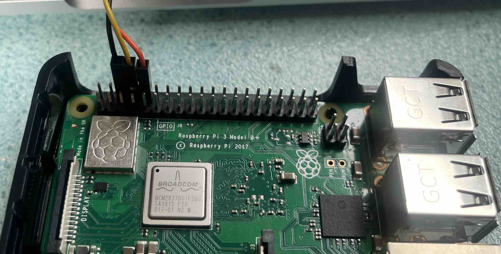

MarinePi
========

[Ansible](https://en.wikipedia.org/wiki/Ansible_(software)) scripts to setup a Raspberry Pi for boat use, providing access to various data sources on board both via wired and wireless connections. Features include:
- [Signal K](http://signalk.org/) [node server](https://github.com/SignalK/signalk-server-node) with NMEA0183 and NMEA 2000 support
- wifi hotspot
- (marina) wifi access with routing
- 3/4G Internet connectivity with Huawei e3372
- VPN access
- various dynamic dns providers (inadyn, Route 53)
- read-only root partition

Usage
=====

1. [Install Ansible](http://docs.ansible.com/ansible/intro_installation.html) on your computer and verify that it works
    - `ansible --version`
    - note: on MacOS Ansible might not be added to your PATH in bash_profile, see [2nd answer in this thread](https://stackoverflow.com/questions/35898734/pip-installs-packages-successfully-but-executables-not-found-from-command-line/35899029) on how to fixed that.
1. Install Raspberry OS Lite on an SD-card with your local computer.

    - Download the [Raspberry Pi Imager](https://www.raspberrypi.org/software/) and start the application
    - Select Raspberry Pi OS Lite (32-bit)
    - Under `Advanced options`:

        - set the hostname to `marinepi` (can be changed later, it's the one used within the scripts here)
        - enable SSH and add your public key
        - set username `pi` and set a passsword `raspberry` or something better
        - configure a wireless lan if your RPi is not connected with ethernet
    - Write your SD Card
1. (Optional) For UART debugging
    1. Enable uart debugging by appending `enable_uart=1` to `config.txt` found in your boot partition
    1. Connect your UART-USB cable to the Rasperry Pi.

1. Insert SD-card in the Raspberry Pi and test the network connection.
    - ssh into your Pi with [standard credentials](https://www.raspberrypi.org/documentation/linux/usage/users.md) (username=pi, password=raspberry):
            `ssh <ip> -l pi`
1. Clone this git repository on your computer
    - 'git clone https://github.com/tkurki/marinepi-provisioning.git '
    - 'cd marinepi-provisioning'
1. Run `./firstrun.sh` from your computer, for the initial setup of your Raspberry Pi.
    - This script will:
        - expand the filesystem
    - The script assumes that your Raspberry Pi is configured with the standard hostname `marinepi.local`. If you want to use its IP address, or another hostname use: `./firstrun.sh <ip-of-your-raspi>` ([find out the IP address](https://www.raspberrypi.org/documentation/remote-access/ip-address.md)).
    - Known problems:
        - MacOS users might see an error because 'sshpass' is not installed by default. See [answer in this thread](https://stackoverflow.com/questions/32255660/how-to-install-sshpass-on-mac) on how to install sshpass (first install XCode and than the XCode command line utilities)
1. Create a copy of `playbooks/example-boat.yml` and edit the settings to match your environment such as the hostname, wifi and hotspot settings, etc.
1. Run `./provision.sh <ip-of-your-raspi> playbooks/example-boat.yml` to provision the software & configurations for the roles in example-boat.yml.
    - Known problems: 
        - After a automated reboot the script might not continue or it presents an 'unreachable' error. After giving it some time and verifying that the connection to the Raspberry Pi, just restart the provisioning process. The process will continue where it has stopped.  
        - An error on installing pysk, see issues on github repo for a solution
    - When the process is finished your Raspberry Pi is ready.  
    Configure signalk through the browser: http://raspberrypi:3000/ or http://raspberrypi/ (log in at the top right and change default userid `pi` and password `password`).
    When you are done with the configuration save .signalk/defaults.json, security.json and settings.json. You can use these in a next provisioning process.

Roles
=====
You define what features you want to provision by adding roles to your playbook.

signalk-npm 
-------
Installs the Signal K Node server. Uses `node` and `node-app` roles to install Node.js and run under systemd.

hotspot
-------
Installs and configures the software needed for the Pi to act as a wifi hotspot. Override variables:
```
hotspot_ssid: MarinePi
hotspot_channel: 11
hotspot_passphrase: NavigareNecesseEst
hotspot_interface: wlan0
```

canboat
-------
Installs canboat utilities to interface with the NMEA 2000 network.

route53-ddns
------------
Installs a cron script that periodically checks your external IP address and updates [Amazon's Route 53 name server information to act as dynamic DNS setup](https://willwarren.com/2014/07/03/roll-dynamic-dns-service-using-amazon-route53/). Installs Amazon's command line tools as a dependency.

For minimal priviledges you should create a limited AWS identity for use with this profile and attach the policy `AmazonRoute53FullAccess`. In your own playbook define variables
```
aws_access_key_id: 'YOUR_ACCESS_KEY_ID'
aws_secret_access_key: 'YOUR_SECRET_ACCESS_KEY'
```
with the information for this limited identity.

wificlient
----------
Installs and configures the software the Pi needs to act as a wifi client. Override variables:
```
wificlient_interface: wlan1
wificlient_networks:
  - ssid: defaultssid
    psk: defaultpassphrase
    priority: 1
    scan_ssid: 0
```
You can add multiple networks by repeating the last four lines, if needed.

pysk
----
Installs the pysk console client on the Pi. See: https://github.com/ph1l/pysk

grafana
-------
Installs grafana. Override variables:
```
grafana_admin_password: admin
grafana_secret: SW2YcwTIb9zpOOhoPsMm
grafana_port: 3000
```

Credits
=======

Fork of [original project](https://github.com/hkapanen/sailpi) with the intention of continuing work in this repo.
